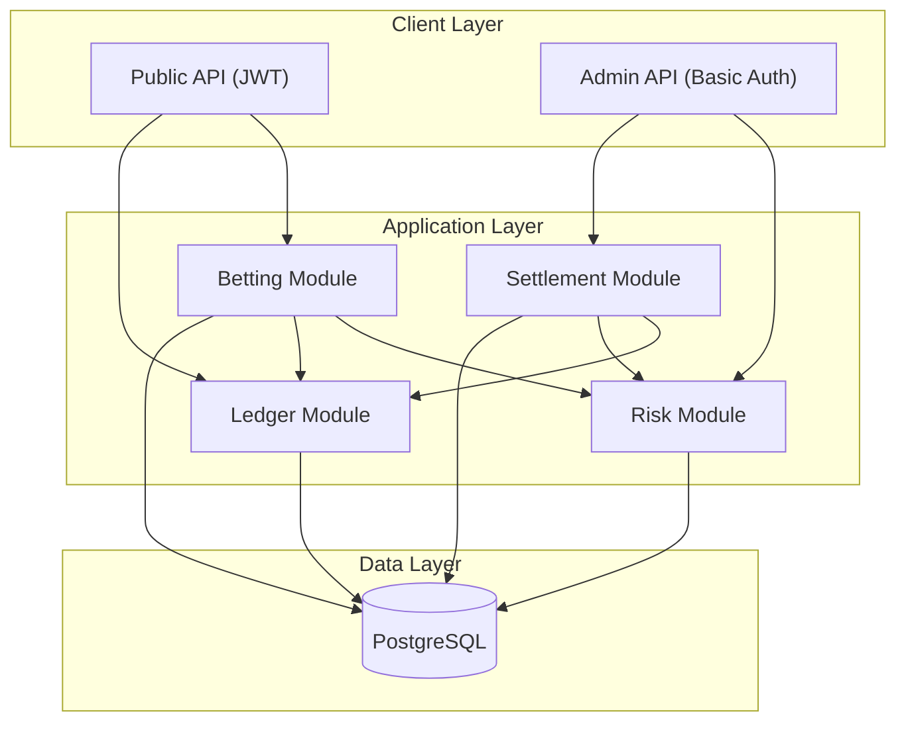
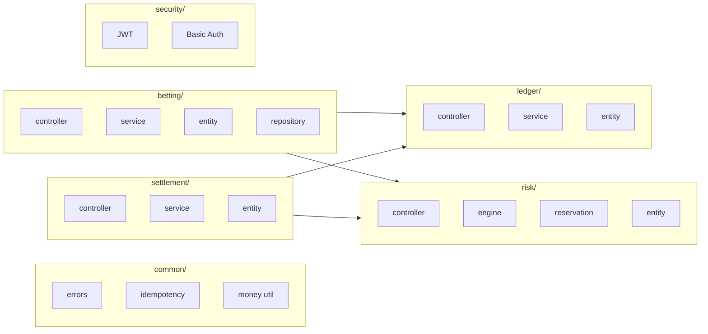
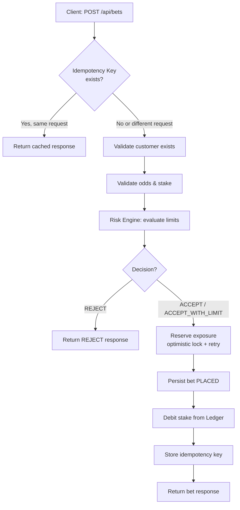
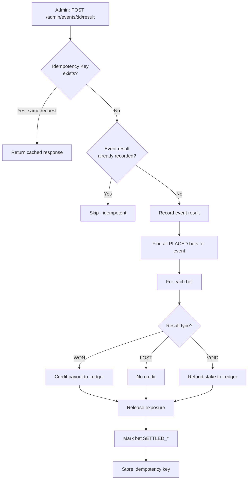
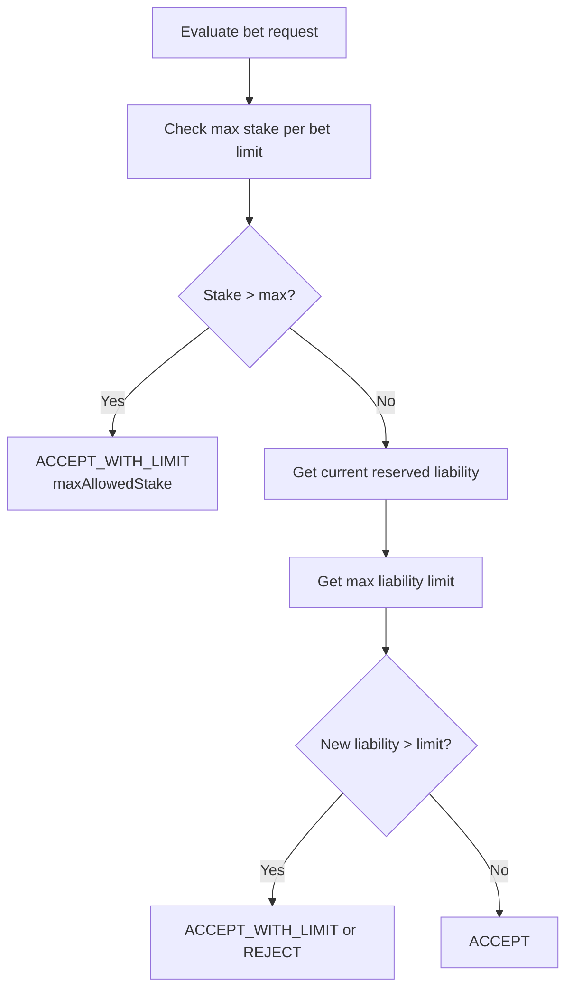
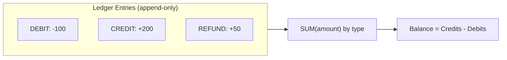
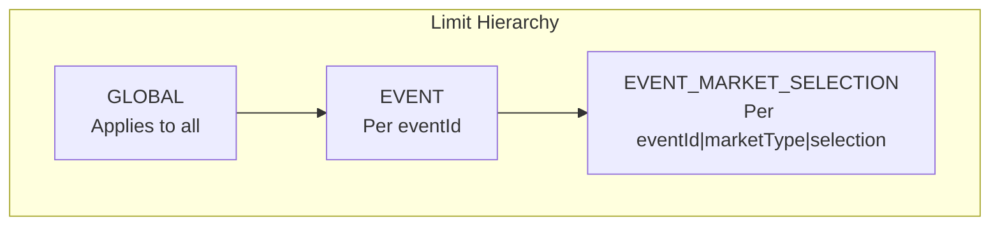
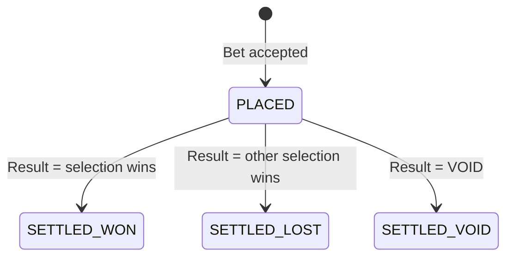
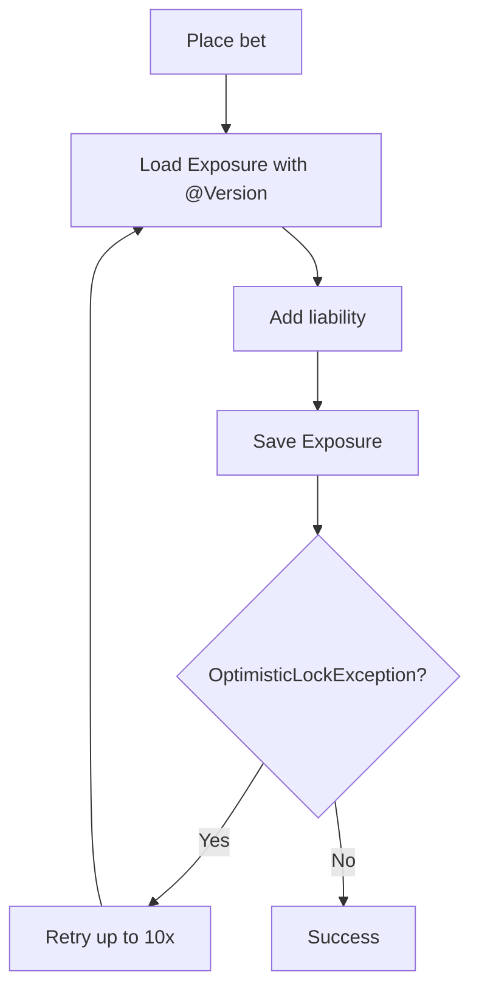
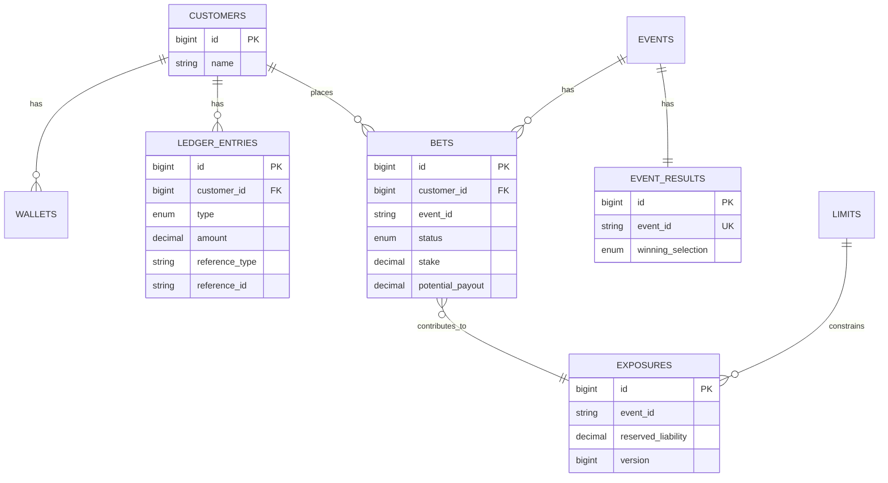

# Sportsbook Risk & Settlement Platform

A **portfolio-grade B2B sports betting platform** implementing a **Risk & Liability Engine** and **Settlement Service**. Built for sportsbook operators (e.g. Kambi, Betsson) who need to manage exposure, enforce limits, and settle bets correctly under concurrency.

---

## Table of Contents

- [Overview](#overview)
- [Architecture](#architecture)
- [Core Flows](#core-flows)
- [Domain Concepts](#domain-concepts)
- [Technical Decisions](#technical-decisions)
- [Data Model](#data-model)
- [API Reference](#api-reference)
- [Quick Start](#quick-start)
- [Tech Stack](#tech-stack)

---

## Overview

This platform handles two critical capabilities for a sportsbook:

1. **Risk & Liability Engine** — Decides whether to ACCEPT, ACCEPT_WITH_LIMIT, or REJECT each bet based on exposure limits. Reserves liability atomically under concurrent load.
2. **Settlement Service** — Ingests event results (HOME/DRAW/AWAY or VOID), settles all affected bets, credits payouts or refunds via an immutable ledger, and releases reserved exposure.

**MVP scope**: Single bets only (one selection per bet), MATCH_WINNER market, decimal odds, SEK currency.

---

## Architecture

### High-Level System Flow



### Package Structure (Package-by-Feature)



---

## Core Flows

### Bet Placement Flow



### Settlement Flow



### Risk Decision Flow



### Ledger Balance Derivation



---

## Domain Concepts

### Exposure & Liability

| Term | Definition |
|------|------------|
| **Exposure** | Per `(eventId, marketType, selection)` — tracks how much we could pay out if that selection wins |
| **Liability** | `potentialPayout - stake` = `stake × (odds - 1)` |
| **Reserved liability** | Sum of liabilities from all PLACED bets on that selection |

### Limit Scopes



### Bet Status Lifecycle



---

## Technical Decisions

### Concurrency: Optimistic Locking + Retry



- **Why**: JPA-friendly, avoids long-held locks, works well with connection pooling
- **Alternative**: Atomic SQL `UPDATE exposure SET liability = liability + :delta WHERE ... AND liability + :delta <= limit` (mentioned in README for future improvement)

### Idempotency Strategy

| Scope | Key | Use Case |
|-------|-----|----------|
| Bet placement | `(customerId, idempotencyKey)` | Same key + same request hash → return cached bet response |
| Result ingest | `(eventId, idempotencyKey)` | Same key + same request → no double settlement |

Different request body with same key → `409 Conflict` (DuplicateIdempotencyKeyException).

### Money Handling

- **BigDecimal** for all money and odds (no `float`/`double`)
- Money scale: 2 (SEK)
- Odds scale: 3

---

## Data Model



### Key Tables

| Table | Purpose |
|-------|---------|
| `ledger_entries` | Append-only; balance derived by `SUM` (never mutate balance column) |
| `exposures` | Per (eventId, marketType, selection); `version` for optimistic locking |
| `idempotency_keys` | Stores request hash + response JSON for replay detection |

---

## API Reference

### Public Endpoints (JWT)

| Method | Path | Description |
|--------|------|--------------|
| POST | `/api/auth/token` | Get JWT (body: `{"customerId": 1}`) |
| POST | `/api/bets` | Place bet (requires `Idempotency-Key` header) |
| GET | `/api/bets/{id}` | Get bet by ID |
| GET | `/api/customers/{id}/ledger` | Paginated ledger entries |

### Admin Endpoints (Basic Auth)

| Method | Path | Description |
|--------|------|--------------|
| POST | `/admin/events/{eventId}/result` | Post result (requires `Idempotency-Key`) |
| GET | `/admin/exposures` | List exposures (optional `?eventId=`) |
| POST | `/admin/limits` | Set/update risk limits |

### Example: Full Bet Lifecycle

```bash
# 1. Get token
TOKEN=$(curl -s -X POST http://localhost:8080/api/auth/token \
  -H "Content-Type: application/json" \
  -d '{"customerId": 1}' | jq -r '.token')

# 2. Place bet
curl -X POST http://localhost:8080/api/bets \
  -H "Authorization: Bearer $TOKEN" \
  -H "Idempotency-Key: bet-$(date +%s)" \
  -H "Content-Type: application/json" \
  -d '{
    "customerId": 1,
    "eventId": "evt-1",
    "marketType": "MATCH_WINNER",
    "selection": "HOME",
    "odds": 1.85,
    "stake": 100
  }'

# 3. Settle (admin)
curl -X POST http://localhost:8080/admin/events/evt-1/result \
  -u admin:admin-secret \
  -H "Idempotency-Key: result-001" \
  -H "Content-Type: application/json" \
  -d '{"winningSelection": "HOME"}'

# 4. Check ledger
curl "http://localhost:8080/api/customers/1/ledger?page=0&size=20" \
  -H "Authorization: Bearer $TOKEN"
```

---

## Quick Start

```bash
# 1. Start Postgres
docker compose up -d

# 2. Run tests
mvn test

# 3. Run application
mvn spring-boot:run
```

- **Swagger UI**: http://localhost:8080/swagger-ui.html  
- **Actuator**: http://localhost:8080/actuator/health  

---

## Tech Stack

| Layer | Technology |
|-------|------------|
| Runtime | Java 21 |
| Framework | Spring Boot 3.2 |
| Database | PostgreSQL, Spring Data JPA, Flyway |
| Security | Spring Security (JWT + Basic Auth) |
| API Docs | springdoc OpenAPI |
| Observability | Micrometer, Actuator |
| Testing | JUnit 5, Testcontainers (Postgres) |

---

## Configuration

| Property | Description |
|----------|-------------|
| `jwt.secret` | JWT signing key (min 32 chars) |
| `admin.username` | Admin Basic Auth user |
| `admin.password` | Use `{noop}plain` for dev, bcrypt hash for prod |
